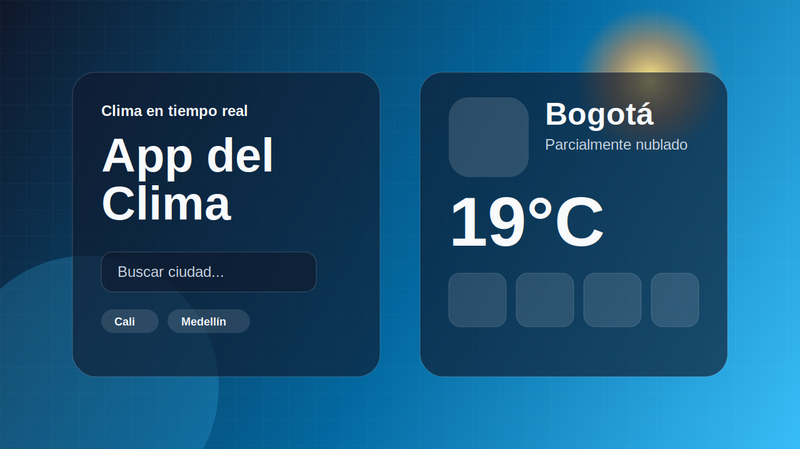

<div align="center">

# 🌦️ App del Clima

Una app web moderna para consultar el clima por ciudad o ubicación actual, con fondos dinámicos, animaciones, pronóstico de 5 días y JavaScript modular.

[](#)
[](#)
[](#)
[](#)

[🌐 Ver demo](https://app-clima-api2.netlify.app) · [🐛 Reportar problema](../../issues) · [✨ Sugerir mejora](../../issues)

</div>



## ✨ Características

- 🔎 Búsqueda por ciudad con botón, tecla Enter y accesos rápidos.
- 📍 Consulta por ubicación actual usando geolocalización del navegador.
- 🌡️ Temperatura, sensación térmica, humedad, viento y dirección del viento.
- 📅 Pronóstico visual de 5 días.
- 🎨 Fondos dinámicos según el clima: soleado, lluvia, tormenta, nieve, niebla y noche.
- 🪄 Animaciones suaves: tarjetas flotantes, nubes, lluvia, brillo y loader animado.
- 📱 Diseño responsive para celular, tablet y escritorio.
- ♿ Mejoras de accesibilidad con etiquetas, `aria-live` y soporte para reducir movimiento.
- 🔐 Sin API key hardcodeada: usa Open-Meteo, una API pública que no requiere llave.
- 🧱 Código más limpio con módulos ES6 separados por responsabilidad.

## 🧰 Tecnologías

| Tecnología | Uso |
|---|---|
| HTML5 | Estructura semántica |
| CSS3 | Glassmorphism, animaciones y responsive design |
| JavaScript ES Modules | Lógica separada y mantenible |
| Open-Meteo | Geocoding y clima actual con pronóstico |
| Netlify | Despliegue estático |

## 📁 Estructura

```txt
App-Clima-Api/
├── assets/
│   ├── favicon.svg
│   └── preview.svg
├── js/
│   ├── app.js
│   ├── config.js
│   ├── ui.js
│   ├── utils.js
│   ├── weather-api.js
│   └── weather-codes.js
├── index.html
├── style.css
├── netlify.toml
├── .gitignore
└── README.md
```

## 🧱 Organización del código

| Archivo | Responsabilidad |
|---|---|
| `js/app.js` | Inicializa la app, escucha eventos y coordina búsquedas |
| `js/weather-api.js` | Consume las APIs de ciudad y clima |
| `js/ui.js` | Renderiza estados de carga, error y resultados |
| `js/weather-codes.js` | Traduce códigos meteorológicos a iconos, textos y temas visuales |
| `js/utils.js` | Formatos, escape HTML, URLs y utilidades reutilizables |
| `js/config.js` | Configuración general, endpoints y parámetros de la API |

## 🚀 Cómo ejecutar localmente

1. Clona el repositorio:

```bash
git clone https://github.com/angelcamayojm-wq/App-Clima-Api.git
cd App-Clima-Api
```

2. Abre `index.html` con Live Server en VS Code.

> Nota: como se usan módulos ES6, es mejor abrirlo con Live Server y no directo con doble clic, porque algunos navegadores bloquean módulos desde `file://`.

## 🌐 APIs usadas

La app usa dos endpoints públicos de Open-Meteo:

- **Geocoding API**: convierte el nombre de la ciudad en coordenadas.
- **Forecast API**: obtiene clima actual y pronóstico de 5 días.

No necesitas crear cuenta ni guardar una API key en el proyecto.

## 🧠 Aprendizajes del proyecto

Este proyecto ayuda a practicar:

- Consumo de APIs con `fetch` y `async/await`.
- Separación de responsabilidades en JavaScript.
- Manejo de errores para búsquedas fallidas, conexión o permisos de ubicación.
- Manipulación del DOM con plantillas dinámicas.
- Responsive design con CSS Grid y media queries.
- Accesibilidad básica en formularios y estados de carga.

## 🛣️ Próximas mejoras sugeridas

- Guardar la última ciudad buscada con `localStorage`.
- Agregar selector °C / °F.
- Mostrar hora de salida y puesta del sol.
- Crear historial de búsquedas recientes.
- Añadir tests básicos para funciones de formato.

## 👨‍💻 Autor

Creado por [@angelcamayojm-wq](https://github.com/angelcamayojm-wq).  
Mejorado visualmente y refactorizado con módulos para que el código sea más claro.

---

<div align="center">

Hecho con café, clima raro y JavaScript ordenadito. ☕🌦️

</div>
